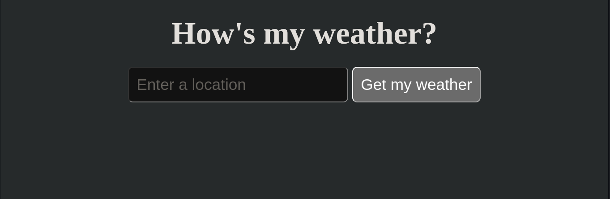

# weather-on-flask
Get your whether powered by flask!

---
## Get the local version
Clone the repository
`git clone https://github.com/Meiroudii/weather-on-flask.git`

Create python environment
`python3 -m venv venv`

Activate the environment (for unix)
`source venv/bin/activate`

Install the required dependencies
`pip3 install -r requirements.txt`

Activate the server
`flask run`
